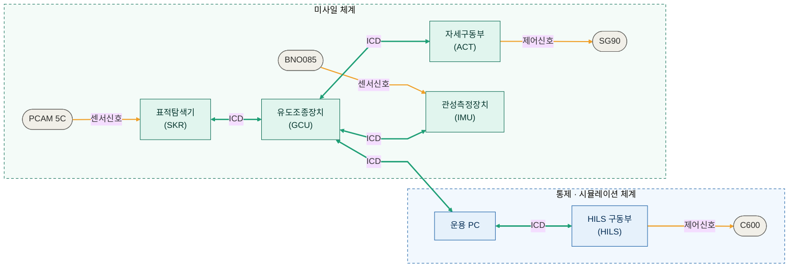

# 🎯 유도무기 시스템 시뮬레이션 프로젝트 (Zynq + FreeRTOS + WPF)

## 프로젝트 개요
 
고비용 유도무기체계는 단 한 번의 소프트웨어 결함이 치명적인 체계 실패로 직결되지만, 실물 발사 시험은 막대한 개발 비용과 물리적·시간적 제약을 동반합니다. 본 프로젝트는 실물 하드웨어 배치 이전에 유도·제어 알고리즘을 반복 검증할 수 있는 **가상 모의 환경**을 구축하는 것을 목표로 합니다.
 
지상 **통제·시뮬레이션 체계**와 **미사일 부체계**를 이원화하여 유기적으로 연동했으며, 소프트웨어만으로 검증하는 **SILS**(Software-in-the-Loop)와 실제 센서·서보 모터를 물리적으로 결합하는 **HILS**(Hardware-in-the-Loop)를 동시에 구축해, 이기종 플랫폼(Windows 통제 UI ↔ FreeRTOS 임베디드 보드) 간 실시간 제어 신뢰성을 정량적으로 실증했습니다.
 
### 핵심 목표
 
- **5단계 운용 시나리오 검증** — 시스템 점검 → 발사 대기 → 발사 → 중기유도(데이터링크) → 종말유도(호밍 추적)
- **실시간 제어 신뢰성 입증** — Windows 타이머 한계를 극복한 정밀 동기화 및 FreeRTOS 기반 태스크 스케줄링 무결성 확보

---

## 🧱 시스템 아키텍처

<p align="center">
  
</p>
ARM 코어(PS)와 FPGA(PL)가 결합된 **Zynq SoC**를 중심축으로 채택하고, 실시간성 확보를 위해 FreeRTOS를 이식하여 임베디드 3계층(Task – Application – HAL) 구조를 확립했습니다. 각 부체계는 자체 개발한 **ICD 프로토콜**로 연동됩니다.
 





---

## ⚙️ 구성 요소

## 부체계 구성
 
| 부체계 | 역할 | 핵심 기술 |
|---|---|---|
| **GCU** 유도조종장치 | 유도·제어 연산 | FreeRTOS 실시간 스케줄링, 확장 비례항법(APN), 공력 이득 역산 + PID 각속도 제어 |
| **SKR** 표적탐색기 | 영상 기반 표적 추적 | PCAM 5C MIPI CSI-2 영상 수집, Union-Find 픽셀 레이블링으로 O(N) 시선각 산출 |
| **ACT** 자세구동부 | 서보 구동 | Zynq PL 4채널 Custom PWM IP(VHDL/Verilog), 서보·2DOF 짐벌 구동 |
| **IMU** 관성측정장치 | 자세 측정 | BNO085 드라이버 최적화, 동적 캘리브레이션 + EMA 필터로 드리프트 방지 |
| **UI / Comm** 지상통제·통신 | 대시보드·통신 | WPF(C#) MVVM, 6DOF 시뮬레이션, RNA 프로토콜 + Stop-and-Wait ARQ + RSA/AES |
---

### 🔹 FPGA (Programmable Logic)

* 고속 데이터 처리
* 사용자 정의 하드웨어 모듈 구현
* AXI 인터페이스 기반 PS-PL 통신

---

### 🔹 WPF 애플리케이션

* 실시간 상태 시각화
* 명령 제어 인터페이스
* 텔레메트리 모니터링

---

## 🔗 통신 구조

| 채널         | 설명              |
| ---------- | --------------- |
| UART / TCP | 명령 및 상태 데이터 송수신 |
| AXI        | PS ↔ PL 데이터 통신  |
| Interrupt  | 이벤트 기반 신호 전달    |

---

## 📂 레포지토리 구조

```id="i9v1mt"
/firmware        # FreeRTOS 기반 임베디드 코드 (Zynq PS)
/fpga            # Vivado 설계 (PL)
/app             # WPF 애플리케이션
/common          # 공통 프로토콜 및 유틸
/docs            # 설계 문서
```

---

## 🚀 시작 방법

### 1. FPGA 설계

* Vivado 프로젝트 열기
* Bitstream 생성 (.bit)
* Hardware Export (.xsa)

---

### 2. 임베디드 (FreeRTOS)

* Vitis에서 `.xsa` import
* FSBL 및 FreeRTOS Application 빌드
* FPGA 프로그래밍 후 실행

---

### 3. WPF 실행

* Visual Studio에서 솔루션 실행
* 통신 포트 설정
* UI 실행

---

## 🧪 주요 기능

* 실시간 제어 루프
* 인터럽트 기반 이벤트 처리
* 하드웨어/소프트웨어 협업 구조
* 모듈화된 시스템 설계

---

## 📈 향후 개발 계획

* 고급 유도 알고리즘 적용
* 센서 융합 기능 추가
* FPGA 가속 최적화
* 네트워크 기반 분산 제어 시스템 확장

---

## ⚠️ 주의사항

본 프로젝트는 **교육 및 시뮬레이션 목적**으로 제작되었습니다.

---

## 👨‍💻 개발자

* 임베디드 / 백엔드 개발자
* 관심 분야: 실시간 시스템, FPGA, 시스템 아키텍처
