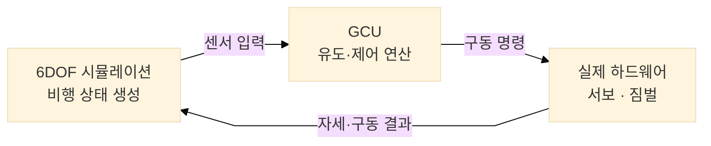
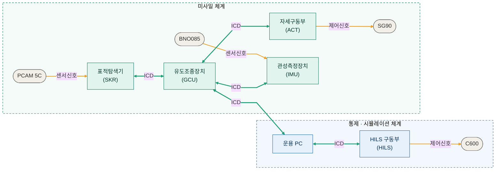
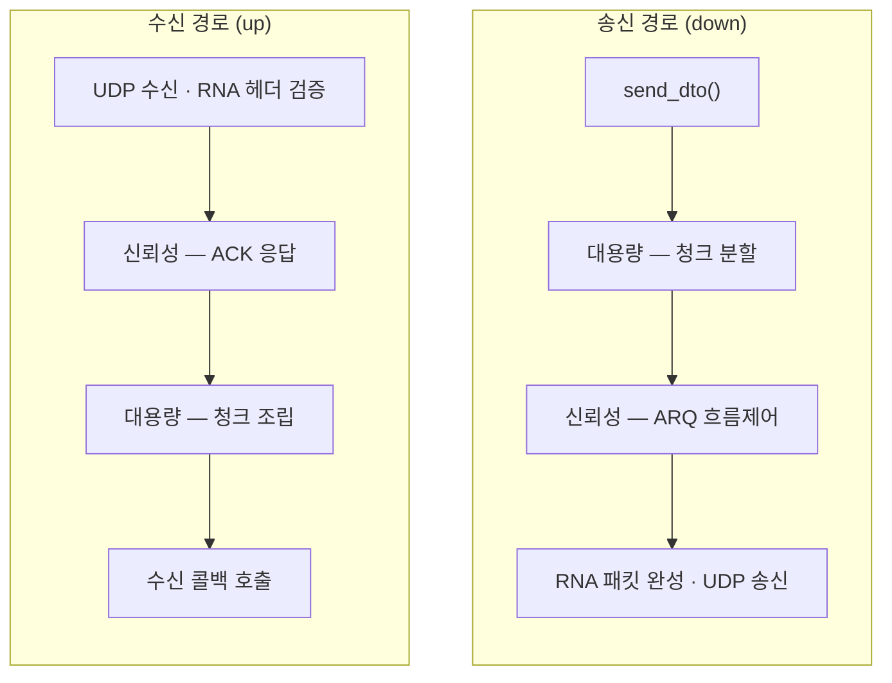

# 🎯 유도무기 시스템 시뮬레이션 프로젝트 (Zynq + FreeRTOS + WPF)

## 프로젝트 개요
 
고비용 유도무기체계는 단 한 번의 소프트웨어 결함이 치명적인 체계 실패로 직결되지만, 실물 발사 시험은 막대한 개발 비용과 물리적·시간적 제약을 동반합니다. 본 프로젝트는 실물 하드웨어 배치 이전에 유도·제어 알고리즘을 반복 검증할 수 있는 **가상 모의 환경**을 구축하는 것을 목표로 합니다.
 
지상 **통제·시뮬레이션 체계**와 **미사일 부체계**를 이원화하여 유기적으로 연동했으며, 소프트웨어만으로 검증하는 **SILS**(Software-in-the-Loop)와 실제 센서·서보 모터를 물리적으로 결합하는 **HILS**(Hardware-in-the-Loop)를 동시에 구축해, 이기종 플랫폼(Windows 통제 UI ↔ FreeRTOS 임베디드 보드) 간 실시간 제어 신뢰성을 정량적으로 실증했습니다.

<table>
  <tr>
    <td></td>
    <td></td>
  </tr>
</table>

 
### 핵심 목표
 
- **5단계 운용 시나리오 검증** — 시스템 점검 → 발사 대기 → 발사 → 중기유도(데이터링크) → 종말유도(호밍 추적)
- **실시간 제어 신뢰성 입증** — Windows 타이머 한계를 극복한 정밀 동기화 및 FreeRTOS 기반 태스크 스케줄링 무결성 확보


---

 
## SILS / HILS 모의 환경
 
본 프로젝트의 핵심은 **동일한 유도·제어 소프트웨어를 두 단계의 모의 환경에서 검증**하는 것입니다.
 
**SILS** (Software-in-the-Loop Simulation) — 센서와 구동기를 포함한 모든 요소를 소프트웨어로 모사합니다. 6DOF 비행 동역학 엔진이 생성한 가상 데이터로 유도 알고리즘을 구동하므로, 실물 하드웨어 없이 대규모 반복 시험(몬테카를로 등)을 빠르고 저렴하게 수행하며 **알고리즘의 무결성을 사전 검증**합니다.
 
**HILS** (Hardware-in-the-Loop Simulation) — SILS의 가상 비행 환경에 **실제 하드웨어**(탐색기 카메라, IMU, 서보 구동기)를 실시간 통신으로 결합합니다. 시뮬레이션이 계산한 비행 상태를 실제 센서·구동축이 받아 동작하고 그 결과가 다시 시뮬레이션으로 피드백되어, **실시간성과 하드웨어 연동성**까지 실증합니다.
 
즉 SILS로 *"알고리즘이 맞는가"*를, HILS로 *"실제 하드웨어에서도 제때 도는가"* 를 단계적으로 검증합니다.
 
| 구분 | SILS | HILS |
|---|---|---|
| 센서 · 구동기 | 소프트웨어 모사 (가상) | 실제 하드웨어 |
| 비행 동역학 | 6DOF 가상 엔진 | 6DOF 가상 엔진 |
| 주 검증 대상 | 알고리즘 무결성 | 실시간성 · HW 연동성 |
| 강점 | 대규모 반복·저비용·고속 | 실제 동작·지연·지터 검증 |
 
HILS는 아래와 같은 실시간 폐루프(closed-loop)로 동작합니다. SILS는 이 루프에서 하드웨어 부분을 소프트웨어로 대체한 형태입니다.
 


---

## 시스템 아키텍처
 

 
> 초록 양방향 선은 자체 개발 **ICD 프로토콜**, 주황 단방향 선은 **센서·제어 신호**입니다.
 
ARM 코어(PS)와 FPGA(PL)가 결합된 **Zynq SoC**를 중심축으로 채택하고, 실시간성 확보를 위해 FreeRTOS를 이식하여 임베디드 3계층(Task – Application – HAL) 구조를 확립했습니다.


---

## ⚙️ 구성 요소

## 부체계 구성
 
| 부체계 | 역할 | 핵심 기술 |
|---|---|---|
| **GCU** 유도조종장치 | 유도·제어 연산 | FreeRTOS 실시간 스케줄링, 확장 비례항법(APN), 공력 이득 역산 + PID 각속도 제어 |
| **SKR** 표적탐색기 | 영상 기반 표적 추적 | PCAM 5C MIPI CSI-2 영상 수집, Union-Find 픽셀 레이블링으로 O(N) 시선각 산출 |
| **ACT** 자세구동부 | 서보 구동 | Zynq PL 4채널 Custom PWM IP(VHDL/Verilog), 서보·2DOF 짐벌 구동 |
| **Comm** 통신 프레임워크 | 통신 | RNA 프로토콜 + Stop-and-Wait ARQ + Chunk + RSA/AES |
| **UI** 지상통제 | 대시보드 | WPF(C#) MVVM, 6DOF 시뮬레이션 |
---

### 🔹 FPGA (Programmable Logic)

* 고속 데이터 처리
* 사용자 정의 하드웨어 모듈 구현
* AXI 인터페이스 기반 PS-PL 통신

---

### 🔹 WPF 애플리케이션

* 실시간 상태 시각화
* 명령 제어 인터페이스
* 텔레메트리 모니터링

---

# 통신 구조

미사일 부체계와 지상 통제 체계를 잇는 통신 계층은 **Zynq SoC + FreeRTOS** 환경에서 동작하는 **UDP / lwIP 기반의 자체 계층형 프로토콜**입니다. 신뢰성이 필요한 명령과 지연에 민감한 고속 데이터를 한 채널에서 함께 처리하기 위해, 전송·신뢰성·보안·대용량 데이터 계층을 분리한 파이프라인 구조로 설계했습니다.

## 개요

- **전송 방식** — Xilinx EMAC과 lwIP BSP를 사용하여 전송 계층의 프로토콜로 UDP를 기반으로 한 자체 프로토콜 RNA를 사용합니다. 디바이스당 단일 UDP 소켓 하나를 생성해 송수신에 공용으로 사용합니다.
- **신뢰성** — 전송 API를 호출시 `RELIABLE` 플래그로 신뢰성 보장 여부를 결정할 수 있습니다. ARQ를 통해 신뢰성을 보장할 수 있습니다.
- **비확인** — 전송 API를 호출시 `NONE` 플래그로 비신뢰성 전송을 결정할 수 있습니다. 비신뢰 전송으로 지연을 최소화할 수 있습니다.
- **보안 데이터** — 전송 API를 호출시 `SECURE` 플래그로 보안 데이터 전송을 결정할 수 있습니다.
- **대용량 데이터** — 탐색기 영상처럼 MTU를 초과하는 데이터는 청크로 분할 전송한 뒤 수신측에서 재조립합니다.

## 디바이스 테이블

모든 디바이스는 포트 `20000`을 사용하며 IP가 고정되어 있습니다.

| 디바이스 | 설명 | IP |
|---|---|---|
| GCU | 유도조종장치 | 192.168.1.10 |
| ACT | 자세구동부 | 192.168.1.20 |
| INS / IMU | 관성측정장치 | 192.168.1.30 |
| SKR | 표적탐색기 | 192.168.1.40 |
| UI | 운용 PC (지상 통제) | 192.168.1.50 |
| HILS | HILS 구동부 | 192.168.1.60 |
| TEST1 | 테스트 장치1 | 192.168.1.70 |
| TEST2 | 테스트 장치2 | 192.168.1.80 |

## 계층형 파이프라인

송신은 위에서 아래로, 수신은 아래에서 위로 각 계층의 파이프 함수를 통과합니다. 각 계층은 자신의 확장 헤더만 책임지고 다음 계층으로 넘깁니다.



## 패킷 구조

패킷은 항상 Base 헤더로 시작하며, 플래그에 따라 확장 헤더가 순서대로 붙습니다.


---

# 레포지토리 구조

본 프로젝트는 **통합(메타) 레포**가 각 부체계 레포를 **서브모듈**로 묶는 다중 레포 구조입니다. 임베디드 부체계(GCU · SKR · ACT · IMU)는 동일한 표준 템플릿을 공유하며, UI는 .NET WPF 기반이라 별도 구조를 따릅니다. ICD/DTO 정의(`common`)와 통신 계층(`comm`)은 모든 임베디드 보드가 공유하는 서브모듈입니다.

## 통합(메타) 레포

문서·아키텍처·각 부체계 링크를 모으는 최상위 레포입니다.


## 임베디드 부체계 표준 구조 (GCU · SKR · ACT · IMU)

Zynq + FreeRTOS 보드는 모두 아래 템플릿을 따릅니다. 코드는 **app(로직) → hal(하드웨어) → rtos(스케줄링)** 3계층으로 나뉘고, 공유 코드는 서브모듈로 가져옵니다.

```
<부체계>/                   # 예: act
├── README.md
├── CMakeLists.txt
├── .clang-format          # 코드 스타일 규칙
├── .gitattributes
├── .gitignore             # 빌드·Vitis 산출물 제외
├── .gitmodules            # comm · common · gtest 연결
├── .vscode/tasks.json
├── .cproject / .project   # Vitis(Eclipse) 프로젝트 메타
├── act.prj                # Vitis 프로젝트 파일
├── _ide/                  # Vitis 생성물 (ps7_init 등)
├── app/                   # 고수준 비즈니스 로직
│   ├── include/           # 서비스 인터페이스 (*.hpp)
│   └── src/               # 서비스 구현 (*.cpp)
├── hal/                   # 하드웨어 추상화 계층
│   ├── include/           # 페리페럴 제어 인터페이스 (GPIO · PWM · 카메라 등)
│   └── src/               # Vitis BSP를 호출하는 실제 드라이버
├── rtos/                  # FreeRTOS 래퍼
│   ├── include/           # Task 핸들러 · Queue 정의
│   └── src/               # Task 생성 및 스케줄링
├── src/                   # 엔트리 포인트
│   ├── main.c             # HW 초기화 후 vTaskStartScheduler() 호출
│   └── lscript.ld         # 링커 스크립트
├── hw/                    # Vivado 하드웨어 산출물
│   ├── *.xsa              # 플랫폼 추출물 (커밋 대상)
│   ├── *.xdc              # 제약 파일 (예: Zybo-Z7-Master.xdc)
│   └── backup.tcl         # 프로젝트 재생성 tcl 스크립트
├── test/
│   ├── unit/              # PC 환경 단위 테스트 (gtest)
│   └── integration/       # HW 연동 통합 테스트
├── comm/    (submodule)    # 통신 계층 (UDP/lwIP/ARQ)
├── common/  (submodule)    # ICD/DTO/enum 공유 정의
└── gtest/   (submodule)    # 테스트 프레임워크
```

### 계층 역할

| 계층 | 역할 |
|---|---|
| `app` | 부체계 고유 로직 — 명령 처리, 상태머신, 제어 연산 |
| `hal` | 페리페럴 드라이버를 인터페이스로 추상화 (상위 계층이 HW에 비종속) |
| `rtos` | FreeRTOS Task·Queue 생성과 스케줄링 래핑 |
| `src` | 부팅 엔트리 포인트 — HW 초기화 후 커널 시작 |
| `comm` / `common` | 보드 간 공통 통신 계층 · ICD 정의 (서브모듈) |
| `hw` | Vivado 플랫폼(XSA)·제약·재생성 스크립트 |
| `test` | PC 단위 테스트 / HW 통합 테스트 |

## UI 레포 (운용 PC · 별도 구조)

WPF + MVVM 기반이라 임베디드 템플릿과 다릅니다.

---

## 기술 스택
 
- **언어** — C++ (임베디드 / GCU), C# .NET WPF (통제 UI), VHDL/Verilog (PWM IP)
- **RTOS / HW** — FreeRTOS, Zynq SoC (PS + PL), PCAM 5C, BNO085, SG90 서보
- **알고리즘** — 확장 비례항법(APN), PID 각속도 제어, Union-Find 표적 추적, EMA 필터
- **시뮬레이션** — 6DOF 비행 동역학(뉴턴–오일러 운동방정식), 데이터 로깅 / 리플레이
- **통신 / 보안** — 자체 RNA 프로토콜, ARQ 흐름제어, RSA/AES 종단간 암호화
---
 
## 주요 성과
 
**SRS 요구사항 104건 전량 달성 (달성률 100%)**
 
제어 주기 정량 계측 결과:
 
| 구간 | 목표 | 실측 (평균) |
|---|---|---|
| GCU 내부 핵심 태스크 | 10 ms | 10.000 ms (9.844 – 10.168) |
| GCU → 구동장치(ACT) 통신 | 20 ms | 19.991 ms (19.644 – 20.356) |
| SKR → UI 영상 통신 | 50 ms | 50.000 ms |
 
### 주요 트러블슈팅
 
- **실시간 주기 발산** — Windows 타이머 한계(15.6ms)·UI 병목으로 오차율 249%까지 발산 → UI/제어 쓰레드 분리 + Busy-Wait 기법으로 **0.5% 이내** 안착
- **탐색기 영상 지터** — 통신 주기가 54ms로 튐 → 부팅 시 Non-cacheable TLB 다이렉트 매핑으로 **50ms (오차 0.2% 이내)** 안정화
- **제어 루프 발산** — 50ms 탐색기 데이터와 20ms IMU 데이터 간 피드백 지연 격차 → GCU 피드백 루프를 **20ms로 완전 동기화**
- **이더넷 먹통** — BSP에 단종된 Marvell 레지스터가 하드코딩됨 → 실장 Realtek RTL8211 데이터시트 기반 레지스터 제어 코드 전면 재설계
---


