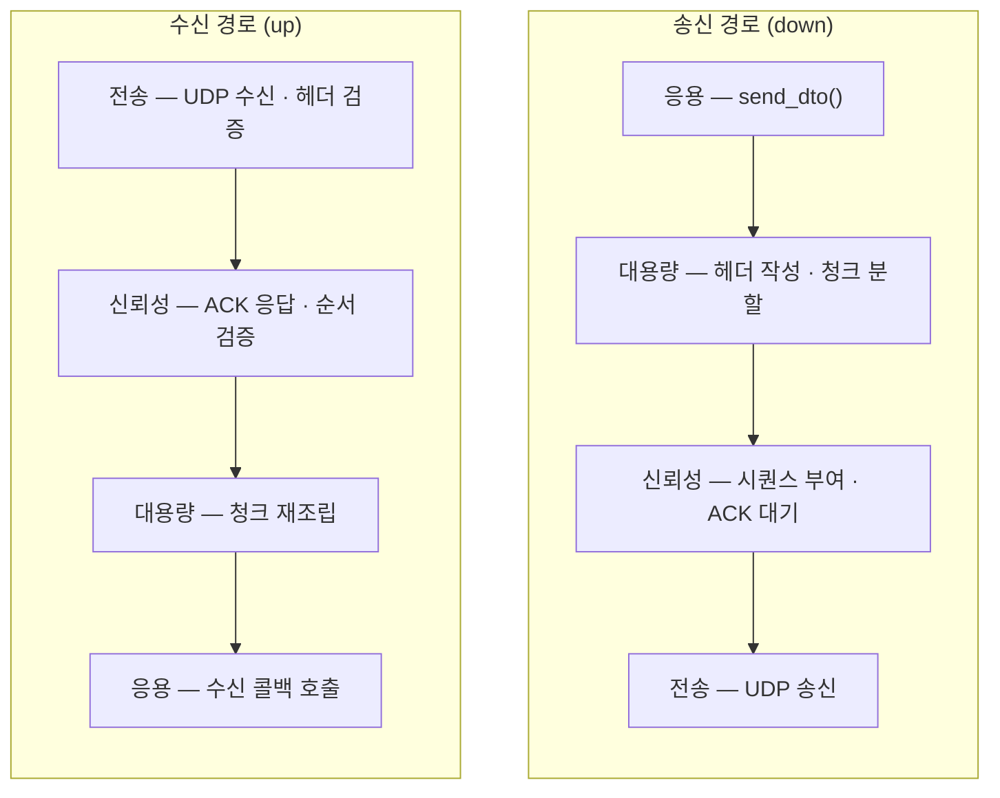
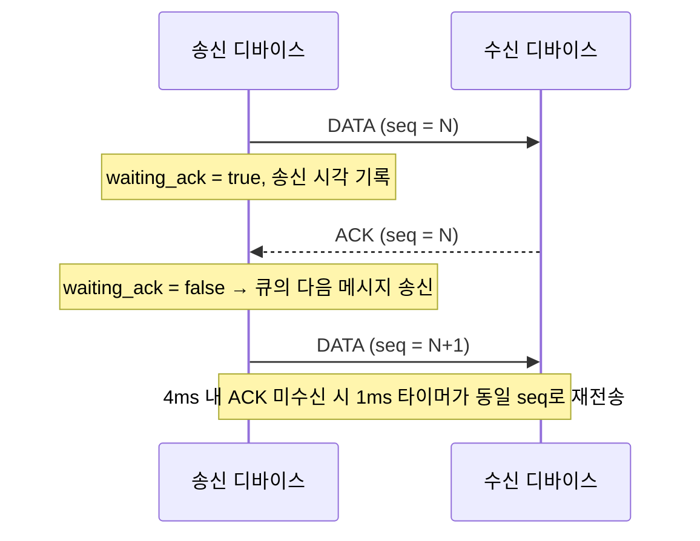

# 🎯 유도무기 시스템 시뮬레이션 프로젝트 (Zynq + FreeRTOS + WPF)

## 프로젝트 개요
 
고비용 유도무기체계는 단 한 번의 소프트웨어 결함이 치명적인 체계 실패로 직결되지만, 실물 발사 시험은 막대한 개발 비용과 물리적·시간적 제약을 동반합니다. 본 프로젝트는 실물 하드웨어 배치 이전에 유도·제어 알고리즘을 반복 검증할 수 있는 **가상 모의 환경**을 구축하는 것을 목표로 합니다.
 
지상 **통제·시뮬레이션 체계**와 **미사일 부체계**를 이원화하여 유기적으로 연동했으며, 소프트웨어만으로 검증하는 **SILS**(Software-in-the-Loop)와 실제 센서·서보 모터를 물리적으로 결합하는 **HILS**(Hardware-in-the-Loop)를 동시에 구축해, 이기종 플랫폼(Windows 통제 UI ↔ FreeRTOS 임베디드 보드) 간 실시간 제어 신뢰성을 정량적으로 실증했습니다.
 
### 핵심 목표
 
- **5단계 운용 시나리오 검증** — 시스템 점검 → 발사 대기 → 발사 → 중기유도(데이터링크) → 종말유도(호밍 추적)
- **실시간 제어 신뢰성 입증** — Windows 타이머 한계를 극복한 정밀 동기화 및 FreeRTOS 기반 태스크 스케줄링 무결성 확보

---

## 시스템 아키텍처
 

 
> 초록 양방향 선은 자체 개발 **ICD 프로토콜**, 주황 단방향 선은 **센서·제어 신호**입니다.
 
ARM 코어(PS)와 FPGA(PL)가 결합된 **Zynq SoC**를 중심축으로 채택하고, 실시간성 확보를 위해 FreeRTOS를 이식하여 임베디드 3계층(Task – Application – HAL) 구조를 확립했습니다.


---

## ⚙️ 구성 요소

## 부체계 구성
 
| 부체계 | 역할 | 핵심 기술 |
|---|---|---|
| **GCU** 유도조종장치 | 유도·제어 연산 | FreeRTOS 실시간 스케줄링, 확장 비례항법(APN), 공력 이득 역산 + PID 각속도 제어 |
| **SKR** 표적탐색기 | 영상 기반 표적 추적 | PCAM 5C MIPI CSI-2 영상 수집, Union-Find 픽셀 레이블링으로 O(N) 시선각 산출 |
| **ACT** 자세구동부 | 서보 구동 | Zynq PL 4채널 Custom PWM IP(VHDL/Verilog), 서보·2DOF 짐벌 구동 |
| **IMU** 관성측정장치 | 자세 측정 | BNO085 드라이버 최적화, 동적 캘리브레이션 + EMA 필터로 드리프트 방지 |
| **UI / Comm** 지상통제·통신 | 대시보드·통신 | WPF(C#) MVVM, 6DOF 시뮬레이션, RNA 프로토콜 + Stop-and-Wait ARQ + RSA/AES |
---

### 🔹 FPGA (Programmable Logic)

* 고속 데이터 처리
* 사용자 정의 하드웨어 모듈 구현
* AXI 인터페이스 기반 PS-PL 통신

---

### 🔹 WPF 애플리케이션

* 실시간 상태 시각화
* 명령 제어 인터페이스
* 텔레메트리 모니터링

---

# 통신 구조

미사일 부체계와 지상 통제 체계를 잇는 통신 계층은 **Zynq SoC + FreeRTOS** 환경에서 동작하는 **UDP / lwIP 기반의 자체 계층형 프로토콜**입니다. 신뢰성이 필요한 명령과 지연에 민감한 고속 데이터를 한 채널에서 함께 처리하기 위해, 전송·신뢰성·대용량 데이터 계층을 분리한 파이프라인 구조로 설계했습니다.

## 개요

- **전송 방식** — lwIP 스택과 Xilinx EMAC(`xemacps`) 위에서 동작하는 UDP. 디바이스당 단일 UDP 소켓 하나를 생성해 송수신에 공용으로 사용합니다.
- **주소 체계** — 동적 탐색 없이 **정적 디바이스 테이블**로 IP·포트·MAC을 고정 매핑합니다. 부팅 시 고정 IP를 설정하고 gratuitous ARP를 전송합니다.
- **선택적 신뢰성** — 메시지마다 `RELIABLE` 플래그로 신뢰성 보장 여부를 결정합니다. 핵심 명령은 ARQ로 보장하고, 고주기 텔레메트리는 비신뢰 전송으로 지연을 최소화할 수 있습니다.
- **대용량 데이터** — 탐색기 영상처럼 MTU를 초과하는 데이터는 청크로 분할 전송한 뒤 수신측에서 재조립합니다.

## 디바이스 테이블

모든 디바이스는 포트 `20000`을 사용하며 IP가 고정되어 있습니다.

| 디바이스 | 설명 | IP |
|---|---|---|
| GCU | 유도조종장치 | 192.168.1.10 |
| ACT | 자세구동부 | 192.168.1.20 |
| INS / IMU | 관성측정장치 | 192.168.1.30 |
| SKR | 표적탐색기 | 192.168.1.40 |
| UI | 운용 PC (지상 통제) | 192.168.1.50 |
| HILS | HILS 구동부 | 192.168.1.60 |
| TEST1 / TEST2 | 시험용 | 192.168.1.70 / .80 |

## 계층형 파이프라인

송신은 위에서 아래로, 수신은 아래에서 위로 각 계층의 파이프 함수를 통과합니다. 각 계층은 자신의 확장 헤더만 책임지고 다음 계층으로 넘깁니다.



## 패킷 구조

패킷은 항상 Base 헤더로 시작하며, 플래그에 따라 확장 헤더가 순서대로 붙습니다. DTO 페이로드 최대 크기는 **1380 바이트**로, MTU 1500에서 이더넷·IP·UDP·전체 헤더를 제외하고도 여유를 두도록 산정했습니다.

| 구성 | 크기 | 주요 필드 |
|---|---|---|
| **Base 헤더** | 7 B | 송신 ID, 수신 ID, 타입 플래그(`RELIABLE` · `BIG_DATA`), 전체 길이 |
| **Reliable 확장 헤더** | 6 B | 채널 고유키(4B), 시퀀스 번호(1B), 플래그(`DATA` / `ACK`) |
| **BigData 확장 헤더** | 14 B | 메시지 ID, 청크 인덱스, 전체 청크 수, 원본 전체 길이, 청크 데이터 길이 |
| **DTO 페이로드** | ≤ 1380 B | 선두에 `IcdId`가 위치하여 상위 계층이 메시지 종류를 식별 |

타입 플래그는 비트마스크로 조합되며, 대용량 분할이 발생하면 `BIG_DATA`가, 신뢰성 전송이면 `RELIABLE`이 함께 설정됩니다.

## 신뢰성 계층 — Stop-and-Wait ARQ

피어별 채널마다 **한 번에 하나의 미확인 메시지(window = 1)**만 전송하는 Stop-and-Wait 방식입니다. 채널이 ACK를 기다리는 동안 들어온 추가 메시지는 피어별 **대기 큐(pending queue)**에 쌓였다가 순서대로 송신됩니다.



- **시퀀스 번호** — 1바이트(0–255) 순환. 수신측은 `expected_rx_seq`와 일치할 때만 상위로 전달하고, 중복·순서 어긋난 패킷은 ACK만 보낸 뒤 폐기합니다.
- **세션 식별(채널 고유키)** — 사이클·캐시 카운터·틱을 섞어 부팅마다 새로 생성하는 32비트 키로, 상대의 재부팅(세션 리셋)을 감지해 시퀀스를 재동기화합니다.
- **재전송 타이머** — 1ms 주기로 모든 피어를 점검해, ACK 대기 시간이 4ms를 넘으면 마지막 패킷을 재전송하고, 대기 중이 아니면 대기 큐에서 다음 메시지를 꺼내 전송합니다. (8회 초과 시 경고 로그, 전송 자체는 계속 시도)

## 대용량 데이터 계층 — 청크 분할 · 재조립

180×320 RGB 영상 등 단일 패킷을 초과하는 데이터를 처리합니다(최대 약 173 KB 버퍼).

- **분할(송신)** — 원본을 1380바이트 청크로 나누고, 각 청크에 동일한 메시지 ID와 청크 인덱스/전체 청크 수를 부여해 개별적으로 신뢰성 파이프로 내려보냅니다.
- **재조립(수신)** — `송신 ID + 메시지 ID`를 키로 조립 버퍼(고정 8슬롯)에 청크를 인덱스 위치에 채우고, 모든 청크가 도착하면 한 번에 상위 콜백으로 전달합니다.
- **중복 차단** — 이미 완료했거나 실패해 폐기한 메시지의 ID는 해시 기반 삭제 리스트(64버킷)에 기록해, 뒤늦게 도착한 같은 메시지의 청크를 무시합니다.
- **만료 처리** — 16ms 주기 타이머가 256ms 이상 갱신되지 않은 조립 버퍼와 만료된 삭제 리스트 항목을 정리해 메모리 누수를 방지합니다.

## 스레드 구성 (FreeRTOS Task)

| 스레드 | 역할 |
|---|---|
| `network_init_thread` | lwIP 초기화, 고정 IP·소켓 바인딩, 하위 스레드 생성 |
| `xemacif_input_thread` | lwIP EMAC 패킷 수신 처리 |
| `recv_network_thread` | UDP 수신, 목적지·길이 검증 후 신뢰성 계층으로 전달 |
| `retransmission_timer_thread` | 1ms 주기 ARQ 재전송 및 대기 큐 비우기 |
| `assembly_expiration_timer_thread` | 16ms 주기 조립 버퍼·삭제 리스트 만료 정리 |

채널 상태, 조립 버퍼, 삭제 리스트는 각각 뮤텍스로 보호되어 멀티스레드 환경에서 안전하게 동기화됩니다.

## 주요 파라미터

| 항목 | 값 |
|---|---|
| 재전송 타이머 주기 | 1 ms |
| ACK 타임아웃 | 4 ms |
| 재전송 경고 임계 | 8 회 |
| 대용량 타이머 주기 | 16 ms |
| 조립 / 삭제 만료 | 256 ms |
| DTO 최대 크기 | 1380 B |
| 대용량 버퍼 최대 | 약 173 KB (180×320 RGB + 여유) |

---

## 📂 레포지토리 구조

```id="i9v1mt"
/firmware        # FreeRTOS 기반 임베디드 코드 (Zynq PS)
/fpga            # Vivado 설계 (PL)
/app             # WPF 애플리케이션
/common          # 공통 프로토콜 및 유틸
/docs            # 설계 문서
```

---

## 🚀 시작 방법

### 1. FPGA 설계

* Vivado 프로젝트 열기
* Bitstream 생성 (.bit)
* Hardware Export (.xsa)

---

### 2. 임베디드 (FreeRTOS)

* Vitis에서 `.xsa` import
* FSBL 및 FreeRTOS Application 빌드
* FPGA 프로그래밍 후 실행

---

### 3. WPF 실행

* Visual Studio에서 솔루션 실행
* 통신 포트 설정
* UI 실행

---

## 🧪 주요 기능

* 실시간 제어 루프
* 인터럽트 기반 이벤트 처리
* 하드웨어/소프트웨어 협업 구조
* 모듈화된 시스템 설계

---

## 📈 향후 개발 계획

* 고급 유도 알고리즘 적용
* 센서 융합 기능 추가
* FPGA 가속 최적화
* 네트워크 기반 분산 제어 시스템 확장

---

## ⚠️ 주의사항

본 프로젝트는 **교육 및 시뮬레이션 목적**으로 제작되었습니다.

---

## 👨‍💻 개발자

* 임베디드 / 백엔드 개발자
* 관심 분야: 실시간 시스템, FPGA, 시스템 아키텍처
